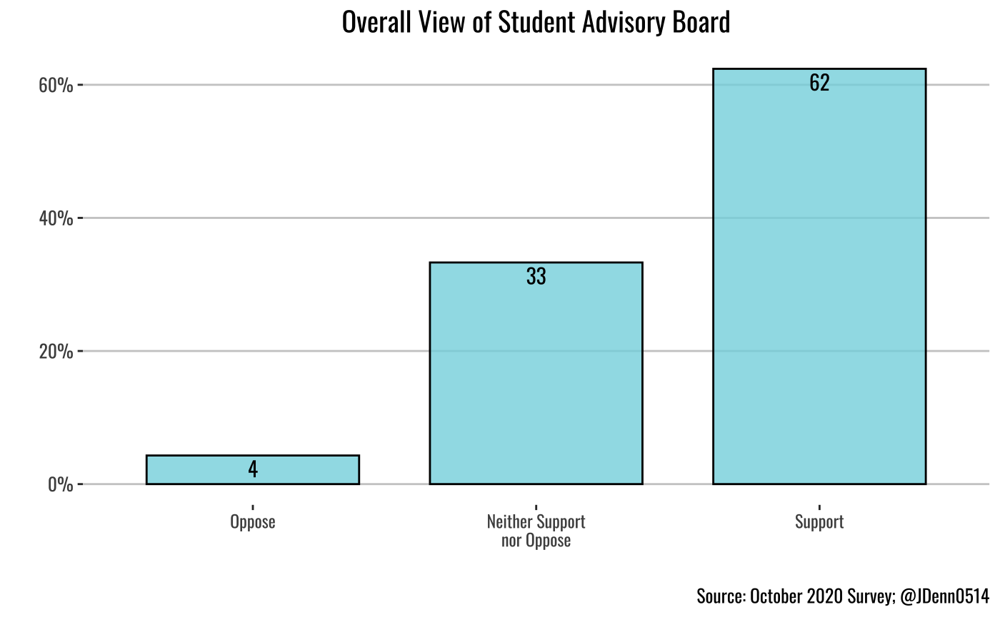

class: split-20

.row.bg-main4[.content.vmiddle[
.center[
#What we will be discussing
]
]]

.row[.split-two[
.column.bg-main1[.content[
  .split-three[
 .row.bg-main1[.content.vmiddle.center[
 # 
 ]]
  .row.bg-main2[.content.vmiddle.center[
     # 
 ]]
   .row.bg-main7[.content.vmiddle.center[
      # 
 ]]
 ]
]]

.column.bg-main1[.content.[
  .split-three[
 .row.bg-main6[.content[
 # 
 ]]
  .row.bg-main8[.content[
     # 
 ]]
   .row.bg-main9[.content[
      # 
 ]]
 ]
]]
]]
]]]

---

class: split-20

.row.bg-main4[.content.vmiddle[
.center[
#What we will be discussing
]
]]

.row[.split-two[
.column.bg-main1[.content[
  .split-three[
 .row.bg-main1[.content.vmiddle.center[
 # Security Cameras
 ]]
  .row.bg-main2[.content.vmiddle.center[
     # 
 ]]
   .row.bg-main7[.content.vmiddle.center[
      # 
 ]]
 ]
]]

.column.bg-main1[.content.[
  .split-three[
 .row.bg-main6[.content[
 # 
 ]]
  .row.bg-main8[.content[
     # 
 ]]
   .row.bg-main9[.content[
      # 
 ]]
 ]
]]
]]
]]]

---

class: split-20

.row.bg-main4[.content.vmiddle[
.center[
#What we will be discussing
]
]]

.row[.split-two[
.column.bg-main1[.content[
  .split-three[
 .row.bg-main1[.content.vmiddle.center[
 # Security Cameras
 ]]
  .row.bg-main2[.content.vmiddle.center[
     # Swipe Access
 ]]
   .row.bg-main7[.content.vmiddle.center[
      # 
 ]]
 ]
]]

.column.bg-main1[.content.[
  .split-three[
 .row.bg-main6[.content[
 # 
 ]]
  .row.bg-main8[.content[
     # 
 ]]
   .row.bg-main9[.content[
      # 
 ]]
 ]
]]
]]
]]]

---

class: split-20

.row.bg-main4[.content.vmiddle[
.center[
#What we will be discussing
]
]]

.row[.split-two[
.column.bg-main1[.content[
  .split-three[
 .row.bg-main1[.content.vmiddle.center[
 # Security Cameras
 ]]
  .row.bg-main2[.content.vmiddle.center[
     # Swipe Access
 ]]
   .row.bg-main7[.content.vmiddle.center[
      # Special Housing
 ]]
 ]
]]

.column.bg-main1[.content.[
  .split-three[
 .row.bg-main6[.content[
 # 
 ]]
  .row.bg-main8[.content[
     # 
 ]]
   .row.bg-main9[.content[
      # 
 ]]
 ]
]]
]]
]]]

---

class: split-20

.row.bg-main4[.content.vmiddle[
.center[
#What we will be discussing
]
]]

.row[.split-two[
.column.bg-main1[.content[
  .split-three[
 .row.bg-main1[.content.vmiddle.center[
 # Security Cameras
 ]]
  .row.bg-main2[.content.vmiddle.center[
     # Swipe Access
 ]]
   .row.bg-main7[.content.vmiddle.center[
      # Special Housing
 ]]
 ]
]]

.column.bg-main1[.content[
  .split-three[
 .row.bg-main6[.content.vmiddle.center[
 # Audits
 ]]
  .row.bg-main8[.content[
     # 
 ]]
   .row.bg-main9[.content[
      # 
 ]]
 ]
]]
]]
]]]

---

class: split-20

.row.bg-main4[.content.vmiddle[
.center[
#What we will be discussing
]
]]

.row[.split-two[
.column.bg-main1[.content[
  .split-three[
 .row.bg-main1[.content.vmiddle.center[
 # Security Cameras
 ]]
  .row.bg-main2[.content.vmiddle.center[
     # Swipe Access
 ]]
   .row.bg-main7[.content.vmiddle.center[
      # Special Housing
 ]]
 ]
]]

.column.bg-main1[.content[
  .split-three[
 .row.bg-main6[.content.vmiddle.center[
 # Audits
 ]]
  .row.bg-main8[.content.vmiddle.center[
     # Student Advisory Board
 ]]
   .row.bg-main9[.content.vmiddle.center[
      # 
 ]]
 ]
]]
]]
]]]

---

class: split-20

.row.bg-main4[.content.vmiddle[
.center[
#What we will be discussing
]
]]

.row[.split-two[
.column.bg-main1[.content[
  .split-three[
 .row.bg-main1[.content.vmiddle.center[
 # Security Cameras
 ]]
  .row.bg-main2[.content.vmiddle.center[
     # Swipe Access
 ]]
   .row.bg-main7[.content.vmiddle.center[
      # Special Housing
 ]]
 ]
]]

.column.bg-main1[.content[
  .split-three[
 .row.bg-main6[.content.vmiddle.center[
 # Audits
 ]]
  .row.bg-main8[.content.vmiddle.center[
     # Student Advisory Board
 ]]
   .row.bg-main9[.content.vmiddle.center[
      # Reserve Fund
 ]]
 ]
]]
]]
]]]

---

class: split-25 bg-main1 hide-slide-number

.row.bg-main1[.content.vmiddle[
.center[
#Security Cameras
]
]]

.row.slide-in-bottom[
.sliderbox.bg-main5.vmiddle[
###Do you support or oppose the following policy? Security cameras should be installed in the hallways and entrances of residential buildings.
]]

---

class: split-30 with-thick-border

.column.bg-main1[.content.vmiddle[
.center[
#Security Cameras
Do you support or oppose the following policy? Security cameras should be installed in the hallways and entrances of residential buildings.
]
]]

.column.bg-main5[.split-25.border-white[
.row[.content.center[
 
###More students actively oppose cameras than support
]]
.row[.content.nopadding[
.fig90[]
]]
]]

---

class: split-30 with-thick-border 

.column.bg-main1[.content.vmiddle[
.center[
#Security Cameras
Do you support or oppose the following policy? Security cameras should be installed in the hallways and entrances of residential buildings.
]
]]

.column.bg-main5[.split-25.border-white[
.row[.content.center[
 
###Women are much more supportive of security cameras than men
]]
.row[.content.nopadding[
.fig90[]
]]
]]

---

class: split-30 with-thick-border 

.column.bg-main1[.content.vmiddle[
.center[
#Security Cameras
Do you support or oppose the following policy? Security cameras should be installed in the hallways and entrances of residential buildings.
]
]]

.column.bg-main5[.split-25.border-white[
.row[.content.center[
 
###Not much racial diversity for support but big differences in how many oppose cameras
]]
.row[.content.nopadding[
.fig90[]
]]
]]

---

class: split-30 with-thick-border 

.column.bg-main1[.content.vmiddle[
.center[
#Security Cameras
Do you support or oppose the following policy? Security cameras should be installed in the hallways and entrances of residential buildings.
]
]]

.column.bg-main5[.split-25.border-white[
.row[.content.center[
 
###Seniors and freshmen are the most supportive of security cameras
]]
.row[.content.nopadding[
.fig90[]
]]
]]

---

class: split-30 with-thick-border 

.column.bg-main1[.content.vmiddle[
.center[
#Security Cameras
Do you support or oppose the following policy? Security cameras should be installed in the hallways and entrances of residential buildings.
]
]]

.column.bg-main5[.split-25.border-white[
.row[.content.center[
 
###Cross Cultural Engagement most supportive, Athletes and Greeks  most opposed
]]
.row[.content.nopadding[
.fig90[]
]]
]]

---

class: split-25 bg-main2 hide-slide-number

.row.bg-main2[.content.vmiddle[
.center[
#Swipe Access
]
]]

.row.slide-in-bottom[
.sliderbox.bg-main5.vmiddle[
.pad10px[
###Starting this academic year, students no longer have swipe access to residential buildings other than their own. This decision was taken by the administration pre-COVID to maximize the safety of hall residents. Some students have reported that this decreases the chances of socializing and building connections with students who live in other dorm buildings, which may be an issue especially for first-year students. Do you support or oppose the decision to take away swipe access?
]
]]

---

class: split-30 with-thick-border 

.column.bg-main2[.content.vmiddle[
.center[
#Swipe Access
Do you support or oppose the decision to take away swipe access?

]
]]

.column.bg-main5[.split-25.border-white[
.row[.content.center[
 
###Most students oppose limiting swipe access
]]
.row[.content.nopadding[
.fig90[]
]]
]]

---

class: split-30 with-thick-border 

.column.bg-main2[.content.vmiddle[
.center[
#Swipe Access
Do you support or oppose the decision to take away swipe access?

]
]]

.column.bg-main5[.split-25.border-white[
.row[.content.center[
 
###Women more opposed than men
]]
.row[.content.nopadding[
.fig90[]
]]
]]

---

class: split-30 with-thick-border 

.column.bg-main2[.content.vmiddle[
.center[
#Swipe Access
Do you support or oppose the decision to take away swipe access?

]
]]

.column.bg-main5[.split-25.border-white[
.row[.content.center[
 
###A lot of diversity among different racial groups
]]
.row[.content.nopadding[
.fig90[]
]]
]]

---

class: split-30 with-thick-border 

.column.bg-main2[.content.vmiddle[
.center[
#Swipe Access
Do you support or oppose the decision to take away swipe access?

]
]]

.column.bg-main5[.split-25.border-white[
.row[.content.center[
 
###Freshmen least supportive and most opposed to increased swipe access
]]
.row[.content.nopadding[
.fig90[]
]]
]]

---

class: split-30 with-thick-border 

.column.bg-main2[.content.vmiddle[
.center[
#Swipe Access
Do you support or oppose the decision to take away swipe access?

]
]]

.column.bg-main5[.split-25.border-white[
.row[.content.center[
 
###Cross cultural engagement groups are most supportive are restricting swipe access
]]
.row[.content.nopadding[
.fig90[]
]]
]]

---

class: split-25 bg-main7 hide-slide-number

.row.bg-main7[.content.vmiddle[
.center[
#Special Housing
]
]]

.row.slide-in-bottom[
.sliderbox.bg-main5.vmiddle[
.pad10px[
###Do you support or oppose the following effort? Housing is actively considering creating more special housing options that enable students to live in dorms centered around a community experience. Examples of these special housing options would include a language and culture house, research focused living communities, and study-abroad student communities.
]
]]

---
class: split-30 with-thick-border 

.column.bg-main7[.content.vmiddle[
.center[
#Special Housing
Do you support or oppose the following effort? Housing is actively considering creating more special housing options that enable students to live in dorms centered around a community experience.
]
]]

.column.bg-main5[.split-25.border-white[
.row[.content.center[
 
###There is a lot more support for special housing than opposition
]]
.row[.content.nopadding[
.fig90[]
]]
]]

---

class: split-30 with-thick-border 

.column.bg-main7[.content.vmiddle[
.center[
#Special Housing
Do you support or oppose the following effort? Housing is actively considering creating more special housing options that enable students to live in dorms centered around a community experience. 
]
]]

.column.bg-main5[.split-25.border-white[
.row[.content.center[
 
###Almost no gender diversity
]]
.row[.content.nopadding[
.fig90[]
]]
]]

---

class: split-30 with-thick-border 

.column.bg-main7[.content.vmiddle[
.center[
#Special Housing
Do you support or oppose the following effort? Housing is actively considering creating more special housing options that enable students to live in dorms centered around a community experience.
]
]]

.column.bg-main5[.split-25.border-white[
.row[.content.center[
 
###Black students overwhelmingly support special housing
]]
.row[.content.nopadding[
.fig90[]
]]
]]

---

class: split-30 with-thick-border 

.column.bg-main7[.content.vmiddle[
.center[
#Special Housing
Do you support or oppose the following effort? Housing is actively considering creating more special housing options that enable students to live in dorms centered around a community experience.
]
]]

.column.bg-main5[.split-25.border-white[
.row[.content.center[
 
###Freshman and seniors are most supportive of special housing
]]
.row[.content.nopadding[
.fig90[]
]]
]]

---

class: split-30 with-thick-border 

.column.bg-main7[.content.vmiddle[
.center[
#Special Housing
Do you support or oppose the following effort? Housing is actively considering creating more special housing options that enable students to live in dorms centered around a community experience. 
]
]]

.column.bg-main5[.split-25.border-white[
.row[.content.center[
 
###Cross cultural engagement groups are most supportive and Greeks are least supportive
]]
.row[.content.nopadding[
.fig90[]
]]
]]

---

class: split-25 bg-main6 hide-slide-number

.row.bg-main6[.content.vmiddle[
.center[
#Audits
]
]]

.row.slide-in-bottom[
.sliderbox.bg-main5.vmiddle[
.pad10px[
###Do you support or oppose the following effort? Housing is actively considering creating more special housing options that enable students to live in dorms centered around a community experience. Examples of these special housing options would include a language and culture house, research focused living communities, and study-abroad student communities.
]
]]

---

class: split-30 with-thick-border 

.column.bg-main6[.content.vmiddle[
.center[
#Audits
Do you support or oppose the following efforts by DCGA? In the Fall of 2020, DCGA passed a resolution establishing finance audits for a randomly selected number of campus organizations per semester to ensure that clubs are spending allocated funds in accordance with their budget.
]
]]

.column.bg-main5[.split-25.border-white[
.row[.content.center[
 
###Almost no gender diversity
]]
.row[.content.nopadding[
.fig90[]
]]
]]

---

class: split-30 with-thick-border 

.column.bg-main6[.content.vmiddle[
.center[
#Audits
Do you support or oppose the following efforts by DCGA? In the Fall of 2020, DCGA passed a resolution establishing finance audits for a randomly selected number of campus organizations per semester to ensure that clubs are spending allocated funds in accordance with their budget.
]
]]

.column.bg-main5[.split-25.border-white[
.row[.content.center[
 
###Men are slightly more opposed to audits than women
]]
.row[.content.nopadding[
.fig90[]
]]
]]

---

class: split-30 with-thick-border 

.column.bg-main6[.content.vmiddle[
.center[
#Audits
Do you support or oppose the following efforts by DCGA? In the Fall of 2020, DCGA passed a resolution establishing finance audits for a randomly selected number of campus organizations per semester to ensure that clubs are spending allocated funds in accordance with their budget.
]
]]

.column.bg-main5[.split-25.border-white[
.row[.content.center[
 
###Very little racial diversity
]]
.row[.content.nopadding[
.fig90[]
]]
]]

---

class: split-30 with-thick-border 

.column.bg-main6[.content.vmiddle[
.center[
#Audits
Do you support or oppose the following efforts by DCGA? In the Fall of 2020, DCGA passed a resolution establishing finance audits for a randomly selected number of campus organizations per semester to ensure that clubs are spending allocated funds in accordance with their budget.
]
]]

.column.bg-main5[.split-25.border-white[
.row[.content.center[
 
###Very little difference among class years
]]
.row[.content.nopadding[
.fig90[]
]]
]]

---

class: split-30 with-thick-border 

.column.bg-main6[.content.vmiddle[
.center[
#Audits
Do you support or oppose the following efforts by DCGA? In the Fall of 2020, DCGA passed a resolution establishing finance audits for a randomly selected number of campus organizations per semester to ensure that clubs are spending allocated funds in accordance with their budget.
]
]]

.column.bg-main5[.split-25.border-white[
.row[.content.center[
 
###DCGA is most supportive. Religious/spiritual life groups are least supportive
]]
.row[.content.nopadding[
.fig90[]
]]
]]

---

class: split-25 bg-main8 hide-slide-number

.row.bg-main8[.content.vmiddle[
.center[
#Student Advisory Board
]
]]

.row.slide-in-bottom[
.sliderbox.bg-main5.vmiddle[
.pad10px[
###Do you support or oppose the following effort by DCGA? In the Spring of 2019, DCGA passed a resolution creating a "Student Advisory Board"composed of 20 randomly selected students representative of the Denison Community. The purpose of the SAB is to deliberate on 1-2 proposals from DCGA each semester to ensure the student body is behind proposals and to increase the democratic legitimacy of DCGA policies.
]
]]

---

class: split-30 with-thick-border 

.column.bg-main8[.content.vmiddle[
.center[
#Student Advisory Board
Do you support or oppose the following effort by DCGA? In the Spring of 2019, DCGA passed a resolution creating a "Student Advisory Board"composed of 20 randomly selected students representative of the Denison Community.
]
]]

.column.bg-main5[.split-25.border-white[
.row[.content.center[
 
###Virtually no opposition 
]]
.row[.content.nopadding[
.fig90[]
]]
]]

---

class: split-30 with-thick-border 

.column.bg-main8[.content.vmiddle[
.center[
#Student Advisory Board
Do you support or oppose the following effort by DCGA? In the Spring of 2019, DCGA passed a resolution creating a "Student Advisory Board"composed of 20 randomly selected students representative of the Denison Community.
]
]]

.column.bg-main5[.split-25.border-white[
.row[.content.center[
 
###Little gender difference in support or opposition
]]
.row[.content.nopadding[
.fig90[]
]]
]]

---

class: split-30 with-thick-border 

.column.bg-main8[.content.vmiddle[
.center[
#Student Advisory Board
Do you support or oppose the following effort by DCGA? In the Spring of 2019, DCGA passed a resolution creating a "Student Advisory Board"composed of 20 randomly selected students representative of the Denison Community.
]
]]

.column.bg-main5[.split-25.border-white[
.row[.content.center[
 
###"Other" students and Asian students are least supportive of SAB
]]
.row[.content.nopadding[
.fig90[]
]]
]]

---

class: split-30 with-thick-border 

.column.bg-main8[.content.vmiddle[
.center[
#Student Advisory Board
Do you support or oppose the following effort by DCGA? In the Spring of 2019, DCGA passed a resolution creating a "Student Advisory Board"composed of 20 randomly selected students representative of the Denison Community.
]
]]

.column.bg-main5[.split-25.border-white[
.row[.content.center[
 
###Not much variation but Juniors are most supportive
]]
.row[.content.nopadding[
.fig90[]
]]
]]

---

class: split-30 with-thick-border 

.column.bg-main8[.content.vmiddle[
.center[
#Student Advisory Board
Do you support or oppose the following effort by DCGA? In the Spring of 2019, DCGA passed a resolution creating a "Student Advisory Board"composed of 20 randomly selected students representative of the Denison Community. 
]
]]

.column.bg-main5[.split-25.border-white[
.row[.content.center[
 
### DCGA by far the most supportive. Not much differentiation among other groups.
]]
.row[.content.nopadding[
.fig90[]
]]
]]

---

class: split-25 bg-main9 hide-slide-number

.row.bg-main9[.content.vmiddle[
.center[
#Reserve Fund
]
]]

.row.slide-in-bottom[
.sliderbox.bg-main5.vmiddle[
.pad10px[
###Do you support or oppose the following efforts by DCGA? Each year, the unspent portion of the student activities fees that DCGA allocates to campus organizations goes into a reserve fund and accumulates. This pool of money can be used to fund special projects that benefit the entire student body- for example, the fund was used to establish the Nest on the 3rd floor of Slayter in 2014. The reserve fund can be opened up to spend if savings cross over $700,000. Proposals on how to best use the reserve fund can be brought forth by any student or group and must be approved by the DCGA Senate.
]
]]

---

class: split-30 with-thick-border 

.column.bg-main9[.content.vmiddle[
.center[
#Reserve Fund
Do you support or oppose the following efforts by DCGA? Each year, the unspent portion of the student activities fees that DCGA allocates to campus organizations goes into a reserve fund and accumulates. This pool of money can be used to fund special projects that benefit the entire student body.
]
]]

.column.bg-main5[.split-25.border-white[
.row[.content.center[
 
###Almost no opposition
]]
.row[.content.nopadding[
.fig90[]
]]
]]

---

class: split-30 with-thick-border 

.column.bg-main9[.content.vmiddle[
.center[
#Reserve Fund
Do you support or oppose the following efforts by DCGA? Each year, the unspent portion of the student activities fees that DCGA allocates to campus organizations goes into a reserve fund and accumulates. This pool of money can be used to fund special projects that benefit the entire student body.
]
]]

.column.bg-main5[.split-25.border-white[
.row[.content.center[
 
### Little gender difference in support or opposition
]]
.row[.content.nopadding[
.fig90[]
]]
]]

---

class: split-30 with-thick-border 

.column.bg-main9[.content.vmiddle[
.center[
#Reserve Fund
Do you support or oppose the following efforts by DCGA? Each year, the unspent portion of the student activities fees that DCGA allocates to campus organizations goes into a reserve fund and accumulates. This pool of money can be used to fund special projects that benefit the entire student body.
]
]]

.column.bg-main5[.split-25.border-white[
.row[.content.center[
 
### "Other" and Asian students are least supportive. Hispanics are most supportive.
]]
.row[.content.nopadding[
.fig90[]
]]
]]

---

class: split-30 with-thick-border 

.column.bg-main9[.content.vmiddle[
.center[
#Reserve Fund
Do you support or oppose the following efforts by DCGA? Each year, the unspent portion of the student activities fees that DCGA allocates to campus organizations goes into a reserve fund and accumulates. This pool of money can be used to fund special projects that benefit the entire student body.
]
]]

.column.bg-main5[.split-25.border-white[
.row[.content.center[
 
### Seniors are least supportive and Freshmen are most supportive.
]]
.row[.content.nopadding[
.fig90[]
]]
]]

---

class: split-30 with-thick-border 

.column.bg-main9[.content.vmiddle[
.center[
#Reserve Fund
Do you support or oppose the following efforts by DCGA? Each year, the unspent portion of the student activities fees that DCGA allocates to campus organizations goes into a reserve fund and accumulates. This pool of money can be used to fund special projects that benefit the entire student body.
]
]]

.column.bg-main5[.split-25.border-white[
.row[.content.center[
 
###DCGA and cross cultural engagement groups are most supportive.
]]
.row[.content.nopadding[
.fig90[]
]]
]]

